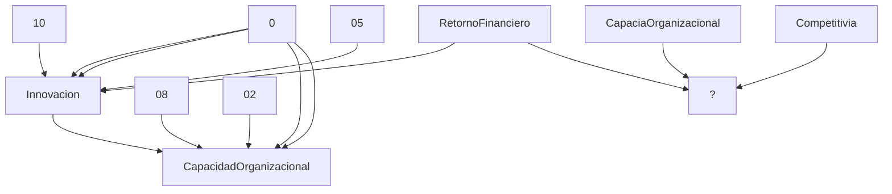

# GP-SABIA-001 — Quantum System Dynamics Model  
**AmpelModel:** `GP-SABIA-001.ampel`  
**Version:** 1.0.2-quantum  
**Tags:** Aeroespacial, Sostenibilidad, QAOA  
**Schema:** quantum-system-dynamics/2.1  

---

## 🧠 Stocks & Dynamics

| Stock | Initial Value | Delta Equation |
|-------|---------------|----------------|
| `Innovacion` | *defined* | `0.10*RetornoFinanciero - 0.05*Innovacion` |
| `CapacidadOrganizacional` | *defined* | `0.08*Innovacion - 0.02*CapacidadOrganizacional` |
| `CapaciaOrganizacional` | ❌ *missing* | *(see equation)* |
| `Competitivia` | ❌ *missing* | *(see equation)* |
| `RetornoFinanciero` | ❌ *missing* | *(see equation)* |

---
## 🔁 Feedback Loops
- **Reinforcement** (strength `0.85`) → Components: `[Innovacion, CapacidadOrganizacional, Competitividad, 
RetornoFinanciero]`
- **Balance** (strength `0.4`) → Components: `[RetornoFinanciero]`


---

## 🔬 Equations

```python
dInnovacion = 0.10*RetornoFinanciero - 0.05*Innovacion
dCapacidadOrganizacional = 0.08*Innovacion - 0.02*CapacidadOrganizacional
dCompetitividad = 0.07*CapacidadOrganizacional - 0.03*Competitividad
dRetornoFinanciero = 0.5*Competitividad - 0.4*RetornoFinanciero
```

---

## 📈 Symbolic Flow (Mermaid)



---

## 🧭 Runtime Objectives (From .ampel)

- **Optimization Step:** Δt = 0.1  
- **Horizon:** 120 cycles  
- **Objective Function:** Max Σ(Competitividad × RetornoFinanciero)  
- **Constraints:**  
  - Innovacion ≥ 5  
  - CapacidadOrganizacional ≤ 95  
  - CO₂ emissions ≤ EU-2030-Limit

---

📂 Source: [`GP-SABIA-001.ampel`](GP-SABIA-001.ampel)  
🧩 Generated by AMPEL Markdown Engine v1.0  
